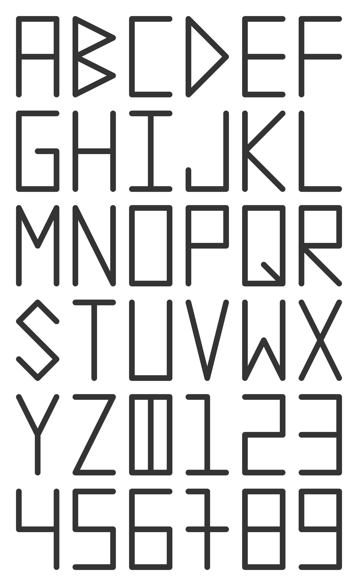

# Whyolet Font

## [Alphanumericals](https://en.wikipedia.org/wiki/Alphanumericals)

## Design

Let's try to make a **simple** font:

* Latin alphabet has relatively few letters and is widely used.
* All languages can be transliterated to latin letters.
* There are 26 big and 26 small latin letters.
* Sometimes we are required to use big letters only: for clarity.
* Some alphabets like Georgian don't have a split to big and small letters.
* So let's design just 26 big letters and use small-caps style if we need both big and small letters.
* We also need 10 arabic digits, also widely used.
* 26 + 10 = 36, so we can put the alphabet into a simple table 6x6.
* We can use a simple grid 2x4 to draw each letter and each digit.
* Let's use as few simple straight lines as possible to make it clear which symbol it is.
* Each letter and digit should not lead to confusion like letter O and digit 0.
* The same form of a symbol can be reused multiple times using rotation like C and U.
* Symbols are grouped using consistent style, e.g. letters S and Z vs digits 5 and 2.

## TODO

* Review once again.
* Create TTF font file.
* Try to use it for [Whyolet website](https://whyolet.com/) and products.
* On success, implement all [requirements](https://googlefonts.github.io/gf-guide/) to upload to [Google Fonts](https://fonts.google.com/).

## License

* This Font Software is licensed under the SIL Open Font License, Version 1.1.
* This license is available with a FAQ at https://scripts.sil.org/OFL
